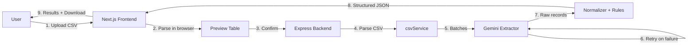

# GrowEasy — AI-Powered CSV Importer

Upload a CSV in **any** format — Facebook Lead exports, Google Ads, real-estate CRM
dumps, marketing sheets, or a manually-typed spreadsheet — and let AI map the columns
into the **GrowEasy CRM** schema automatically.

The hard part isn't parsing CSV. It's handling arbitrary column names, layouts and messy
data, then intelligently extracting the right CRM fields. This project solves that with
careful prompt engineering, a clean batch-processing backend, and a polished, responsive UI.

---

## Table of Contents

- [Features](#features)
- [Architecture](#architecture)
- [Tech Stack](#tech-stack)
- [Project Structure](#project-structure)
- [Getting Started](#getting-started)
- [Environment Variables](#environment-variables)
- [API Reference](#api-reference)
- [How the AI Extraction Works](#how-the-ai-extraction-works)
- [CRM Schema & Rules](#crm-schema--rules)
- [Testing](#testing)
- [Running with Docker](#running-with-docker)
- [Deployment](#deployment)
- [Sample Data](#sample-data)

---

## Features

### Core requirements

| Requirement | Implemented |
| --- | --- |
| Upload a valid CSV (drag & drop **and** file picker) | ✅ |
| Preview parsed rows in a responsive table (sticky headers, horizontal + vertical scroll) | ✅ |
| No AI processing until the user confirms | ✅ |
| **Confirm** button triggers the backend | ✅ |
| Backend accepts any CSV without assuming fixed columns | ✅ |
| CSV parsed into records and sent to AI **in batches** | ✅ |
| AI maps arbitrary fields into GrowEasy CRM format | ✅ |
| Structured JSON returned (imported, skipped, totals) | ✅ |
| Result view: parsed records, skipped records, totals | ✅ |

### Bonus features

| Bonus | Implemented |
| --- | --- |
| Drag & drop upload | ✅ |
| Progress indicator during AI processing | ✅ |
| **Streaming / incremental processing** (real batch-by-batch progress via NDJSON) | ✅ |
| **Virtualized tables** (windowed rendering for large CSVs) | ✅ |
| Retry mechanism for failed AI batches (exponential backoff) | ✅ |
| Dark mode (persisted, no flash on load) | ✅ |
| Unit tests (Jest, 35 tests) | ✅ |
| Docker setup (multi-stage images + `docker compose`) | ✅ |
| Detailed README | ✅ |
| Download extracted leads as clean CSV | ✅ |
| Graceful partial results (a failed batch skips only its rows) | ✅ |

---

## Architecture



The frontend parses the CSV locally for an instant preview (no server round-trip). Only
after the user clicks **Confirm** is the file uploaded to the backend, which re-parses it,
sends rows to Gemini in batches, defensively normalizes the output against the business
rules, and returns structured JSON.

---

## Tech Stack

- **Frontend:** Next.js 14 (App Router), React 18, TypeScript, Tailwind CSS, PapaParse
- **Backend:** Node.js, Express, TypeScript, Multer, PapaParse, Zod
- **AI:** Google Gemini (`@google/generative-ai`) with JSON schema-constrained output
- **Testing:** Jest + ts-jest
- **Tooling:** Docker (multi-stage), Docker Compose

---

## Project Structure

```
GrowEasy/
├── backend/
│   ├── src/
│   │   ├── config/          # Environment loading & validation
│   │   ├── controllers/     # Request handlers
│   │   ├── middleware/      # Upload (multer) + central error handler
│   │   ├── routes/          # Express routers
│   │   ├── services/        # csv, ai (Gemini), extraction orchestration, prompt
│   │   ├── types/           # Shared CRM domain types & enums
│   │   ├── utils/           # Errors, logger, JSON extraction, CRM normalizer
│   │   ├── app.ts           # Express app factory
│   │   └── server.ts        # Bootstrap + graceful shutdown
│   ├── tests/               # Jest unit tests
│   └── Dockerfile
├── frontend/
│   ├── src/
│   │   ├── app/             # App Router: layout, page, globals
│   │   ├── components/      # Upload, tables, stepper, theme, result view…
│   │   └── lib/             # API client, browser CSV parsing, types
│   └── Dockerfile
├── samples/                 # Example messy CSV for testing
└── docker-compose.yml
```

---

## Getting Started

### Prerequisites

- **Node.js 20+** and npm
- A **Gemini API key** — create one free at <https://aistudio.google.com/app/apikey>

### 1. Backend

```bash
cd backend
npm install
cp .env.example .env        # then edit .env and set GEMINI_API_KEY
npm run dev                 # starts on http://localhost:4000
```

### 2. Frontend

In a second terminal:

```bash
cd frontend
npm install
cp .env.example .env.local  # default API URL already points at localhost:4000
npm run dev                 # starts on http://localhost:3000
```

Open <http://localhost:3000>, upload a CSV (try [`samples/messy-leads.csv`](samples/messy-leads.csv)),
preview it, and click **Confirm & Import with AI**.

> On Windows PowerShell, use `Copy-Item .env.example .env` instead of `cp`.

---

## Environment Variables

### Backend (`backend/.env`)

| Variable | Default | Description |
| --- | --- | --- |
| `PORT` | `4000` | HTTP port |
| `NODE_ENV` | `development` | Environment mode |
| `CORS_ORIGIN` | `http://localhost:3000` | Comma-separated allowed origins (`*` to allow all) |
| `MAX_UPLOAD_BYTES` | `10485760` | Max upload size (10 MB) |
| `GEMINI_API_KEY` | — | **Required.** Your Gemini API key |
| `GEMINI_MODEL` | `gemini-2.5-flash-lite` | Gemini model name |
| `AI_BATCH_SIZE` | `25` | Rows sent to the AI per batch |
| `AI_MAX_RETRIES` | `3` | Retry attempts per failed batch |

### Frontend (`frontend/.env.local`)

| Variable | Default | Description |
| --- | --- | --- |
| `NEXT_PUBLIC_API_BASE_URL` | `http://localhost:4000` | Backend base URL (inlined at build time) |

---

## API Reference

### `GET /api/health`

Health probe.

```json
{ "status": "ok", "aiConfigured": true, "timestamp": "2026-07-07T10:00:00.000Z" }
```

### `POST /api/leads/extract`

Multipart upload that extracts CRM leads from a CSV.

- **Body:** `multipart/form-data` with a single `file` field (`.csv`)
- **Response `200`:**

```json
{
  "imported": [
    {
      "created_at": "2026-05-13 14:20:48",
      "name": "John Doe",
      "email": "john.doe@example.com",
      "country_code": "+91",
      "mobile_without_country_code": "9876543210",
      "company": "GrowEasy",
      "city": "Mumbai",
      "state": "Maharashtra",
      "country": "India",
      "crm_status": "GOOD_LEAD_FOLLOW_UP",
      "crm_note": "Client asking to reschedule demo",
      "data_source": "eden_park"
    }
  ],
  "skipped": [
    { "row": 6, "reason": "Record has neither an email nor a mobile number.", "data": { "...": "..." } }
  ],
  "totalImported": 1,
  "totalSkipped": 1,
  "totalRows": 2
}
```

- **Errors:** `400` (no/invalid file, empty CSV), `503` (AI not configured / unavailable),
  `500` (unexpected). All errors return `{ "error": string, "message": string }`.

Example:

```bash
curl -F "file=@samples/messy-leads.csv" http://localhost:4000/api/leads/extract
```

### `POST /api/leads/extract/stream`

Same input as above, but streams progress **incrementally** as newline-delimited JSON
(NDJSON) so the UI can show a real, batch-by-batch progress bar and render results as they
arrive. One JSON object per line:

```jsonc
{ "type": "meta",  "totalRows": 100, "totalBatches": 4, "batchSize": 25 }
{ "type": "batch", "batch": 1, "totalBatches": 4, "processedRows": 25, "totalRows": 100, "imported": [ /* ... */ ], "skipped": [ /* ... */ ] }
{ "type": "done",  "totalImported": 96, "totalSkipped": 4, "totalRows": 100 }
```

If extraction fails after the stream has started, a final `{ "type": "error", "message": "..." }`
line is emitted.

---

## How the AI Extraction Works

Prompt engineering is central to this project. The strategy:

1. **A single, detailed system instruction** ([`backend/src/services/prompt.ts`](backend/src/services/prompt.ts))
   defines the CRM schema, all allowed enum values, date rules, note-merging rules, ambiguous
   column-mapping hints, and the requirement to keep each record a single CSV row.
2. **JSON-only output** — Gemini is configured with `responseMimeType: application/json` so it
   returns a clean JSON array rather than prose (parsed defensively, tolerating stray fences).
3. **Batching** — rows are processed in configurable batches (`AI_BATCH_SIZE`) so large files
   stay within token limits and results stream in incrementally.
4. **Retries with backoff** — transient failures (rate limits, timeouts, 5xx) are retried up to
   `AI_MAX_RETRIES` times with exponential backoff. A batch that still fails only skips **its own
   rows**, so the rest of the import still succeeds.
5. **Defensive normalization** ([`backend/src/utils/crmNormalizer.ts`](backend/src/utils/crmNormalizer.ts))
   — the AI output is never trusted blindly. The backend re-enforces every rule: enum coercion,
   date validation (`new Date()`), first-email/first-mobile selection with the rest appended to
   `crm_note`, newline escaping, and dropping unknown fields.

This "LLM proposes, code disposes" design keeps the output correct even when the model is
imperfect.

---

## CRM Schema & Rules

Extracted fields: `created_at`, `name`, `email`, `country_code`,
`mobile_without_country_code`, `company`, `city`, `state`, `country`, `lead_owner`,
`crm_status`, `crm_note`, `data_source`, `possession_time`, `description`.

Enforced rules:

- **`crm_status`** ∈ `GOOD_LEAD_FOLLOW_UP`, `DID_NOT_CONNECT`, `BAD_LEAD`, `SALE_DONE`
- **`data_source`** ∈ `leads_on_demand`, `meridian_tower`, `eden_park`, `varah_swamy`,
  `sarjapur_plots` (blank if none match confidently)
- **`created_at`** must be parseable by `new Date()`; otherwise it's dropped and preserved in a note
- **Multiple emails/mobiles:** keep the first, append the rest to `crm_note`
- **Single-row safety:** newlines inside any value are escaped as `\n`
- **Skip rule:** a record with neither an email nor a mobile number is skipped (with a reason)

---

## Testing

```bash
cd backend
npm test
```

30 unit tests cover CSV parsing & batching, CRM normalization (enums, dates, multi-value
handling, newline escaping), robust JSON extraction from model responses, and the full
extraction pipeline (imports, skips, batch splitting, and batch-failure handling) using an
injected fake AI extractor for deterministic, offline runs.

---

## Running with Docker

Build and run the whole stack with one command:

```bash
# From the repo root — set your key first (PowerShell shown):
$env:GEMINI_API_KEY = "your_key_here"
docker compose up --build
```

- Frontend: <http://localhost:3000>
- Backend: <http://localhost:4000>

Both images are multi-stage for small production footprints; the frontend uses Next.js
standalone output.

---

## Deployment

The frontend and backend deploy independently.

**Frontend → Vercel**

1. Import the repo, set the root directory to `frontend`.
2. Add env var `NEXT_PUBLIC_API_BASE_URL` = your deployed backend URL.
3. Deploy.

**Backend → Render / Railway**

1. New Web Service from the repo, root directory `backend`.
2. Build: `npm install && npm run build` · Start: `npm start`.
3. Add env vars `GEMINI_API_KEY` and `CORS_ORIGIN` (your Vercel URL).
4. Deploy, then point the frontend's `NEXT_PUBLIC_API_BASE_URL` at this URL.

---

## Sample Data

[`samples/messy-leads.csv`](samples/messy-leads.csv) intentionally mixes formats to showcase
the AI mapping: renamed columns (`Full Name`, `Phone`, `Campaign`), combined city/state,
multiple emails and phone numbers, mixed date formats, an empty row, and a row with no
contact info (which is correctly skipped).
